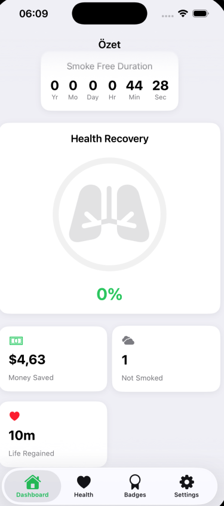
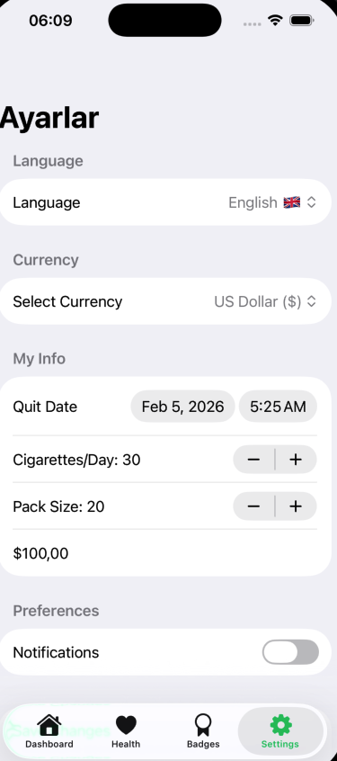

# BreathNew 🌿 - Stop Smoking & Heal

<div align="center">
  <p>
    <strong>Track your journey to a smoke-free life with real-time health stats and savings calculator.</strong>
  </p>
  
  <p>
    <a href="#features">Features</a> •
    <a href="#tech-stack">Tech Stack</a> •
    <a href="#screenshots">Screenshots</a>
  </p>
</div>

---

## 📖 About The Project

**BreathNew** is a modern iOS application designed to help users quit smoking. Unlike simple counters, it focuses on the *gains* rather than the loss. It visualizes lung recovery, calculates money saved in real-time with multi-currency support, and tracks the exact time passed since the last cigarette.

Built entirely with **SwiftUI**, it offers a seamless and native experience with support for **Dark Mode** and **Localization (English & Turkish)**.

## ✨ Key Features

* **⏱ Real-Time Tracker:** Tracks years, months, days, hours, minutes, and seconds smoke-free.
* **🫁 Health Visualization:** Dynamic lung animation that fills up as your health recovers.
* **💰 Savings Calculator:** Automatically calculates money saved based on user inputs.
* **🌍 Multi-Currency Support:** Support for USD ($), EUR (€), GBP (£), and TRY (₺).
* **🇹🇷/🇬🇧 Localization:** Full support for Turkish and English languages.
* **⚙️ Customizable Settings:** Users can edit quit dates, pack prices, and habits.

## 📸 Screenshots

<div align="center">
  <table>
    <tr>
      <td align="center"><strong>Dashboard (Light)</strong></td>
      <td align="center"><strong>Settings (Turkish)</strong></td>
      <td align="center"><strong>Dashboard (Dark)</strong></td>
    </tr>
    <tr>
      <td></td>
      <td></td>
      <td></td>
    </tr>
  </table>
</div>

*(Note: These are actual screenshots from the running application.)*

## 🛠 Tech Stack

* **Language:** Swift 5
* **UI Framework:** SwiftUI
* **Architecture:** MVVM (Model-View-ViewModel)
* **Data Persistence:** @AppStorage / UserDefaults
* **Tools:** Xcode, Git & GitHub

## 🚀 How to Run

1.  Clone the repo:
    ```sh
    git clone [https://github.com/aliyakarr9/BreathNewV2-iOS.git](https://github.com/aliyakarr9/BreathNewV2-iOS.git)
    ```
2.  Open `BreathNew.xcodeproj` in Xcode.
3.  Select a simulator (e.g., iPhone 15 Pro) and press **Run (Cmd+R)**.

---

<div align="center">
  <p>Developed with ❤️ by Ali Yakar</p>
</div>
