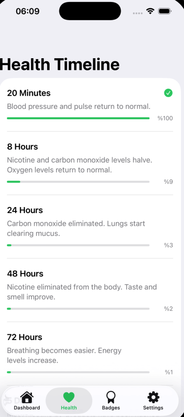
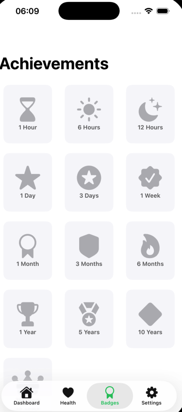

# BreathNew 🌿 - Stop Smoking & Heal

  

    <strong>Track your journey to a smoke-free life with real-time health stats, multi-currency savings calculator, and achievements.</strong>
  

  
  

    <a href="#features">Features</a> •
    <a href="#screenshots">Screenshots</a> •
    <a href="#tech-stack">Tech Stack</a>
  

---

## 📖 About The Project

**BreathNew** is a modern iOS application designed to help users quit smoking by focusing on positive progress. It visualizes lung health recovery, calculates money saved in real-time with multi-currency support (USD, EUR, GBP, TRY), tracks smoke-free duration down to the second, and rewards progress with achievements.

Built entirely with **SwiftUI**, it offers a seamless, native experience with full support for **English and Turkish** languages.

## ✨ Key Features

* **⏱ Real-Time Tracker:** Tracks years, months, days, hours, minutes, and seconds smoke-free.
* **🫁 Health Recovery:** Visualizes lung health improvement with dynamic animations.
* **💰 Multi-Currency Savings:** Automatically calculates money saved in ₺, $, €, or £.
* **🏆 Achievements:** Unlocks badges for milestones (e.g., 24 Hours, 1 Week, 1 Month).
* **🌍 Localization:** Fully localized for English and Turkish speakers.
* **⚙️ Customizable:** Easily adjust quit date, cigarettes per day, and pack price.

## 📸 Screenshots

  <table>
    <tr>
      <td align="center"><strong>Dashboard</strong></td>
      <td align="center"><strong>Settings</strong></td>
    </tr>
    <tr>
      <td></td>
      <td></td>
    </tr>
    <tr>
      <td align="center"><strong>Health Timeline</strong></td>
      <td align="center"><strong>Badges (Achievements)</strong></td>
    </tr>
    <tr>
      <td></td>
      <td></td>
    </tr>
  </table>

*(Note: These are actual screenshots from the application.)*

## 🛠 Tech Stack

* **Language:** Swift 5
* **UI Framework:** SwiftUI
* **Architecture:** MVVM (Model-View-ViewModel)
* **Data Persistence:** @AppStorage (UserDefaults)
* **Localization:** String Catalogs (.xcstrings)
* **Tools:** Xcode, Git & GitHub

---

  
Developed with ❤️ using SwiftUI

